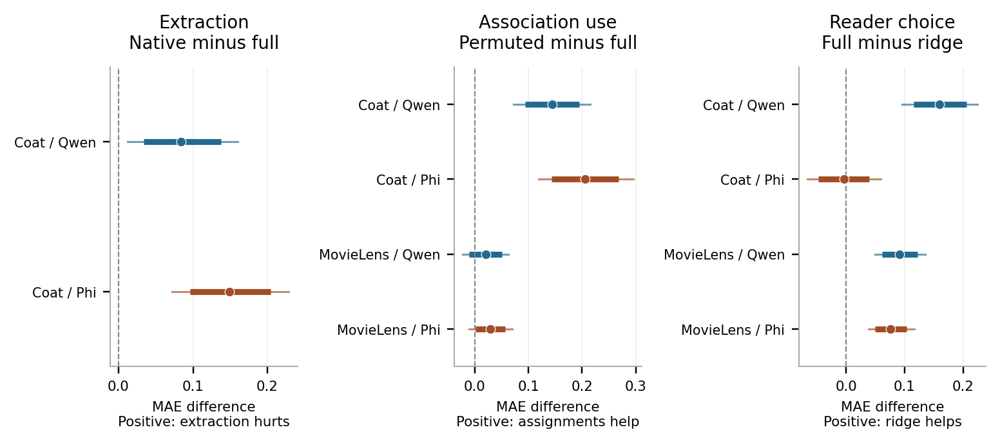

# Auditing Personal AI Memory with Rating-Preserving Controls

**Shivam Gupta · Research preprint · September 2026**

A completed controlled study of native memory extraction, historical-association use, and reader choice. The evaluation covers **400 held-out user profiles, 6,160 target ratings, two datasets, two quantized language-model readers, and 3,000 model calls**. The code, protocols, per-user error summaries, figures, and paper are released here.

[Read the paper](output/pdf/Shivam_Gupta_Personal_AI_Memory_Paper.pdf) · [Anonymous manuscript](output/pdf/Personal_AI_Memory_Anonymous.pdf) · [Reproduction guide](docs/confirmation-reproduction.md) · [Complete results](docs/confirmation-results.md)

## What this study adds

A memory system can improve on no history while still performing worse than the source history it received. We audit that gap using the native Mem0 extraction path, complete-memory reading, and a control that permutes ratings within each user's history. The control preserves the exact rating multiset, rated items, attributes, history length, and item order. It changes which historical item receives which rating.

The contribution is the controlled empirical study and its auditable implementation. Permutation methods, numerical recommenders, language-based profiles, and concerns about aggregate rating metrics are established prior work. Correct historical associations can reflect shared item quality as well as individual differences, so this experiment does not identify uniquely personal taste.

## Main findings

Effects are paired differences in user-macro mean absolute error on a 1-to-5 rating scale. Brackets show family-adjusted 99.5% percentile bootstrap intervals across the ten predeclared primary comparisons.

| Comparison | Coat / Qwen | Coat / Phi | MovieLens / Qwen | MovieLens / Phi |
|---|---:|---:|---:|---:|
| Native memory minus full history | +0.084 [0.012, 0.160] | +0.149 [0.072, 0.229] | Not tested | Not tested |
| Permuted minus correct history | +0.144 [0.072, 0.215] | +0.205 [0.119, 0.295] | +0.020 [-0.022, 0.062] | +0.029 [-0.011, 0.069] |
| Full-history LLM minus history-only ridge | +0.160 [0.095, 0.225] | -0.004 [-0.067, 0.059] | +0.091 [0.049, 0.135] | +0.076 [0.038, 0.117] |

- Native extraction increases downstream error for both Coat readers, even though the resulting memories improve on no history. The paired common-valid sensitivity supports the same direction.
- Correct historical assignments help both readers on Coat. The smaller MovieLens association effects remain inconclusive after family adjustment.
- History-only ridge has lower error in three of four full-history reader comparisons. The Coat Phi comparison establishes neither superiority nor equivalence.
- All 150 invalid reader outputs are retained under the fixed constant-3 fallback. No response is retried or repaired. Reliability differs by model, domain, and evidence condition.



## Evidence and validation

Both protocols, selected penalties, splits, inference code, and analysis locks were publicly committed at [`2f0d896`](https://github.com/shi1720/personal-ai-memory-studies/commit/2f0d896) before evaluation inference. Accuracy was not inspected until both readers completed both datasets. An earlier Coat archive audit inspected aggregate distributions; evaluation users were held out from predictive fitting, tuning, and scoring, not from every descriptive inspection of the archive.

Coat provides 200 evaluation users and 2,960 new-to-history target ratings from a randomly elicited test set. MovieLens provides a separate 200-user metadata-only validation with 3,200 observed-rating targets. MovieLens is not a chronological or random-exposure evaluation. Qwen3-4B-Instruct-2507 writes Coat memory through pinned Mem0 2.1.0; Qwen and Phi-4 read it. MovieLens tests full, permuted, and absent history without a native writer.

A separate implementation checks all **2,800 reader inputs**, **4,600 user-system records**, and **ten primary contrasts** directly against the original local responses and source archives. Its maximum continuous-metric discrepancy is below **2.1e-14**. A further verifier regenerates aggregates and bootstrap intervals from all **5,400 released per-user error summaries**, without source data or models. The measurement suite has **110 passing tests**. These are computational checks and held-out validation, not external laboratory replication or peer review.

Key records:

- [Coat protocol](docs/confirmation-protocol.md), [MovieLens protocol](docs/movie-validation-protocol.md), and [execution record](docs/confirmation-execution-record.md)
- [Coat analysis](results/confirmation-analysis.json) and [MovieLens analysis](results/movie-validation-analysis.json)
- [Separate calculation check](results/independent-calculation-check.json), [published-summary verification](results/published-results-verification.json), and [resource and precision audit](results/confirmation-auxiliary-report.json)
- [Literature reading record](references/confirmation-literature.json) and [manuscript sources](paper)

## Reproduce the released calculations

Use a fresh Python environment, then run:

```sh
python -m pip install -r requirements-analysis.txt
python -m unittest discover -s tests
python src/verify_published_results.py
python src/build_confirmation_figures.py
python src/build_confirmation_tables.py
```

These commands check and regenerate released measurements. They do not rerun the language models. Exact raw-response scoring and fresh inference have additional data, licensing, hardware, and dependency requirements described in the [reproduction guide](docs/confirmation-reproduction.md). The original inference used Apple Silicon and MLX; this is not a portable CUDA package.

To build both PDFs, install `requirements-paper.txt` and Tectonic, then run `python src/build_research_paper.py`. The builder checks references, overflow, page limits, anonymity of the manuscript copy, and analysis hashes. Both PDFs have 14 pages including references and supplementary material; the main text and impact statement fit within eight pages. Official ICML 2026 styles are used in preprint mode with their notices preserved.

## Scope and release status

This is a completed research preprint, **not submitted, accepted, or peer reviewed**. Conference formatting does not establish conference readiness or acceptance. The study covers two historical metadata domains, two fixed quantized readers, and one writer configuration. It does not establish a general ranking of memory systems, query-time retrieval performance, or conversational usefulness. Public dataset contamination in pretraining cannot be excluded.

Raw datasets, model weights, full rating prompts, generated memory texts, local databases, and credentials are not redistributed. Per-user errors use dataset row identifiers, not newly collected personal identities. Code licensing does not grant rights to third-party data or models. See [release notes](RELEASE.md) and the [file manifest](release-manifest.json).

Earlier exploratory work, corrections, and rejected hypotheses remain in the repository and [historical overview](ARCHIVE.md). Those studies are not pooled with the final evaluation and were not publicly preregistered before collection. The final study's public freeze is separate from that earlier history.

Contact: [shivam1720406@gmail.com](mailto:shivam1720406@gmail.com)
