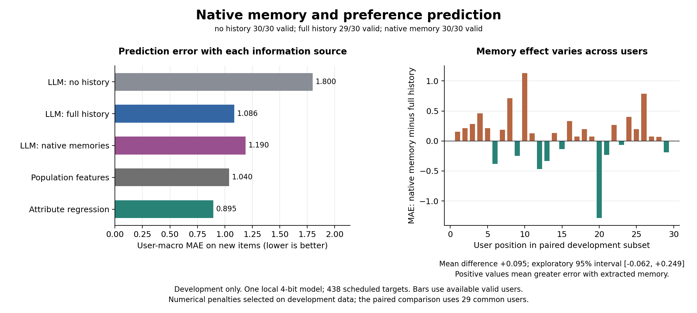

# Native memory and observed preference prediction

Research owner: Shivam Gupta. Completed 19 September 2026.
Status: exploratory development study, not a new algorithm or confirmatory result.

## Finding

The native-memory condition has a higher point estimate of prediction error
than full history, but the paired uncertainty interval crosses zero. This
study does not establish a reliable average degradation from extraction.
Established numerical personalization provides a stronger descriptive reference
than either LLM condition. A general claim that memory extraction destroys
personalization is not supported by these results.

## What was run

The protocol was committed as `4a0a842` before development inference. Thirty
users from the frozen Coat split each supplied 24 observed rating records.
Predictions concerned 438 new user-item pairs; known-item overlaps were excluded.
The 200 reserved users remain unscored. No target ratings were supplied to the
writer or reader.

Each user received one native Mem0 write into a fresh persistent store, followed
by three prediction conditions: no personal history, complete observed history,
and all stored memory texts. The local model was the pinned 4-bit Qwen3-4B
Instruct 2507 conversion. Native additive extraction, dense embeddings, BM25,
spaCy, Qdrant and SQLite were enabled. The reader was our fixed rating adapter,
not Mem0's published benchmark setup. All stored texts were supplied, so this
comparison does not test retrieval ranking.

All 30 writers completed without recorded errors or output truncation. All 90
reader calls returned, but one full-history response was invalid: user row 24
received 17 predictions for 16 targets. The response finished normally; the
strict length check rejected it. It was not truncated, retried or repaired.

## Prediction results

Lower error is better. MAE averages each user's absolute error equally; RMSE
is the square root of the mean user MSE. Ratings range from 1 to 5.

| Condition | Valid users | Valid targets | MAE | RMSE |
| :--- | ---: | ---: | ---: | ---: |
| LLM, no history | 30 | 438 | 1.7997 | 2.0993 |
| LLM, full history | 29 | 422 | 1.0864 | 1.4438 |
| LLM, native memory | 30 | 438 | 1.1898 | 1.5246 |
| Population mean | 30 | 438 | 1.0375 | 1.1988 |
| Population attributes | 30 | 438 | 1.0398 | 1.2053 |
| Shrunk user mean | 30 | 438 | 1.0085 | 1.1641 |
| Personalized attribute regression | 30 | 438 | 0.8948 | 1.1325 |

The numerical penalty settings were selected on this same development set.
Their comparisons are descriptive and not independent estimates of method
superiority. The first table also has different available-case cohorts.

The primary comparison instead uses the same 29 valid users in both conditions:
full-history MAE 1.0864, native-memory MAE 1.1812, paired difference **+0.0949**.
The 10,000-replicate paired-user bootstrap gives an exploratory 95% percentile
interval of **[-0.0624, +0.2488]**. Memory has lower error for nine users and
higher error for twenty, with no exact ties. The mean interval and the win count
answer different questions; the latter does not remove uncertainty in the mean.

Under the separately declared operational fallback, the invalid full-history
response uses the fixed population-attribute predictor. Full-history operational
MAE becomes 1.0797 and RMSE 1.4361 across all 30 users. This is a mixed system
with an explicit fallback, not the score of a repaired LLM response. The other
two LLM conditions have complete validity and need no fallback.



The left panel shows available-case means. The right panel is the primary
paired comparison. The vector figure is available as
`results/figures/coat-memory-development.pdf`.

## Resource accounting

| Component | Calls with responses | Prompt tokens | Output tokens | Total tokens |
| :--- | ---: | ---: | ---: | ---: |
| Native writing | 30 | 267,344 | 29,976 | 297,320 |
| No-history reading | 30 | 17,531 | 1,352 | 18,883 |
| Full-history reading | 30 | 44,785 | 1,347 | 46,132 |
| Native-memory reading | 30 | 35,800 | 1,344 | 37,144 |

Total recorded token usage is 399,479 across 120 calls. Native storage contains
493 memory entries and 57,707 UTF-8 bytes of memory text. These bytes exclude
original-message storage, vectors, databases and entity links. Fewer entries
do not prove omitted source evidence, since a single entry may contain many
observations. No compression-ratio claim is made for the whole system.

The trace includes per-call wall times and cache-token information. The runtime
was warmed and other local CPU work overlapped the study. These timings are not
an isolated hardware comparison or a production latency guarantee.

## Interpretation and next decision

This screen confirms that the complete native pipeline runs on observed ratings
and that history helps this reader relative to its no-history condition. It
does not isolate a strong extraction-specific failure: full-history prediction
itself is weak relative to conventional controls, and the primary mean contrast
is uncertain. Scaling this exact setup across the reserved users would not
create a new contribution.

A follow-up needs a concrete mechanism or method beyond existing numerical
personalization, and evidence that the reader can use the relevant information.
Any diagnostic on these completed traces is post hoc and must remain separate
from this frozen primary analysis. Do not selectively drop extreme users or
repair the invalid output to improve the conclusion.

Limits include one small quantized model, short structured histories, one
product domain, item-order rather than chronological histories, public-data
contamination risk, and development selection. These results cannot establish
frontier-model behavior, causal preference recovery, long-term user modelling,
or ICML-level novelty. No submitted or accepted paper is claimed.

## Reproduction and integrity

Run these commands only after the frozen inference trace is complete:

```sh
python3 src/analyze_coat_memory_development.py
python3 src/plot_coat_memory_development.py
```

The analyzer rejects partial runs, checks all frozen dependencies and raw trace
hashes, validates the complete user/context grid, and applies the original
parser again. `results/coat-memory-development-analysis.json` retains per-user
errors, coverage, numerical references, paired effects and resource totals.
Raw third-party records remain in ignored `data/`. Thirteen Coat tests and four
MemoryCD audit tests passed during this continuation. The figure was visually
inspected.
