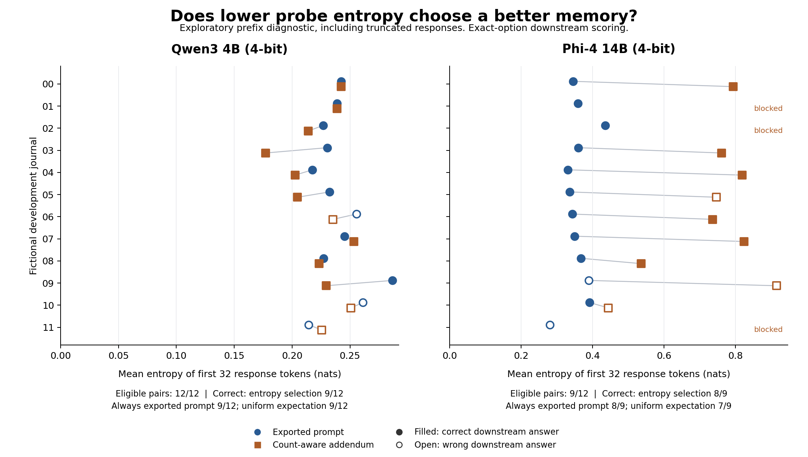

# Memory-probe development screen: results

2026-09-19. Complete exploratory component check. Not a trained MMPO reproduction, a confirmatory study or a conference-ready contribution.

## Outcome

All 72 scheduled records are accounted for: 69 actual generations and three blocked-writer placeholders. The two model processes completed successfully. There are 12 fictional development journals shared across both models, not 24 independently sampled users. Inference dependencies match their frozen hashes.

Measured generation time: 971.80 seconds, excluding model-file verification and loading. Qwen has 36 calls and 34 unique prompts; Phi has 33 calls and 33 unique prompts. The two repeated Qwen input pairs produced identical text and token-level measurements.

The main completed-response score yields **zero eligible writer pairs in either model**. All 36 Qwen responses and 26 of 33 Phi responses reach the 256-token limit. Phi completes one full-history response and six count-aware responses, but no exported-prompt response. Main-score selection accuracy is therefore undefined, not zero.

## Predeclared first-32-token diagnostic

This diagnostic includes truncated responses and must not be substituted for the unavailable main comparison. The cost above covers the actual full calls. It is not the cost of an implemented 32-token stopping policy.

| Model | Scoring | Eligible pairs | Lower entropy: correct | Always exported prompt: correct | Uniform choice: expected correct |
| --- | --- | ---: | ---: | ---: | ---: |
| qwen | Strict JSON answer | 12 | 9 | 9 | 9 |
| qwen | Exact-option sensitivity | 12 | 9 | 9 | 9 |
| phi | Strict JSON answer | 9 | 7 | 7 | 5.5 |
| phi | Exact-option sensitivity | 9 | 8 | 8 | 7 |

Qwen selects the count-aware candidate on eight journals, the exported-prompt candidate on two, and ties on the two identical-input journals. Both candidates have identical downstream correctness on every journal, so this comparison cannot measure a selection advantage.

Phi selects the exported-prompt candidate on all nine eligible journals. It matches the fixed baseline and exceeds uniform random choice on this development subset. The exact-option sensitivity has only two discordant pairs; the strict-format version has three. Neither justifies a general performance claim or a significance test over tokens.



The plot uses model-specific horizontal scales. Token entropy values should not be interpreted as calibrated error probabilities or compared directly across different tokenizers. Filled symbols show correct downstream answers, not source-faithful memories.

## Source fidelity is a separate outcome

For Qwen journal extract-03, the count-aware summary has 18 audited false dated-activity claims. Its prefix entropy is 0.1770 nats, below the exported-prompt summary at 0.2305. Both yield the correct downstream frequency answer. One false claim says Day 04 was a pottery session that was not enjoyed; the source instead records an enjoyed painting session. The same summary retains the 24 correct source outcome-days as well, so omission is not the only issue.

On extract-05, the exported-prompt summary has four false dated claims while the count-aware summary has none found by the limited grammar. The prefix score favors the latter, correctly for this audit comparison. These opposing examples are retained together. The audit grammars differ across models and residual prose is unjudged; these are not comprehensive human factuality labels. Every case is joined to the existing audit in the analysis JSON.

## Interpretation and decision

The exact mathematical examples include a ranking reversal, an uninformative tie, and a posterior-sampling positive control in which entropy accurately tracks latent-state uncertainty. Zero conditional mutual information does not imply that entropy cannot work. It identifies an assumption that must be distinguished from empirical calibration. See [the interpretation note](memory-probe-interpretation.md).

This screen is not promoted to the main paper. Its primary comparison is unavailable, its prefix comparison does not improve on the fixed baseline, and its candidate pairs provide little discriminatory power. Familiar confidence failures and ordinary source checks are not a novel algorithm. The results neither reproduce nor refute trained MMPO.

A larger-budget rerun of these same twelve journals would not fix the lack of candidate-quality variation. Before expanding this direction, the study would need a precise unresolved contribution, fresh histories, a preflight showing usable completed probes, enough informative candidate pairs, and faithful published baselines. The original and diagnostic scores remain separate. No manuscript, submission or public research repository is claimed at this checkpoint.

## Reproduction and validation

```sh
python3 -m unittest discover -s tests -p "test_memory_probe*.py" -v
python3 src/memory_probe_information.py
.venv/bin/python src/run_memory_probe_screen.py --model qwen
.venv/bin/python src/run_memory_probe_screen.py --model phi
python3 src/analyze_memory_probe.py
python3 src/plot_memory_probe.py
```

Ten targeted tests pass. The analyzer validates complete case sets, frozen dependencies, original evidence, prompt hashes, token counts, EOS placement, score recomputation, writer validity and downstream trace hashes. The figure was rendered and visually inspected. No model generation was silently repaired or rerun at another budget.

Artifacts: `results/memory-probe-{qwen,phi}-predictions.jsonl`, matching manifests, `results/memory-probe-analysis.json`, the frozen protocol in `docs/memory-probe-information.md`, and source/reading records in `references/`. All measurements are local research artifacts; none has been publicly published.
